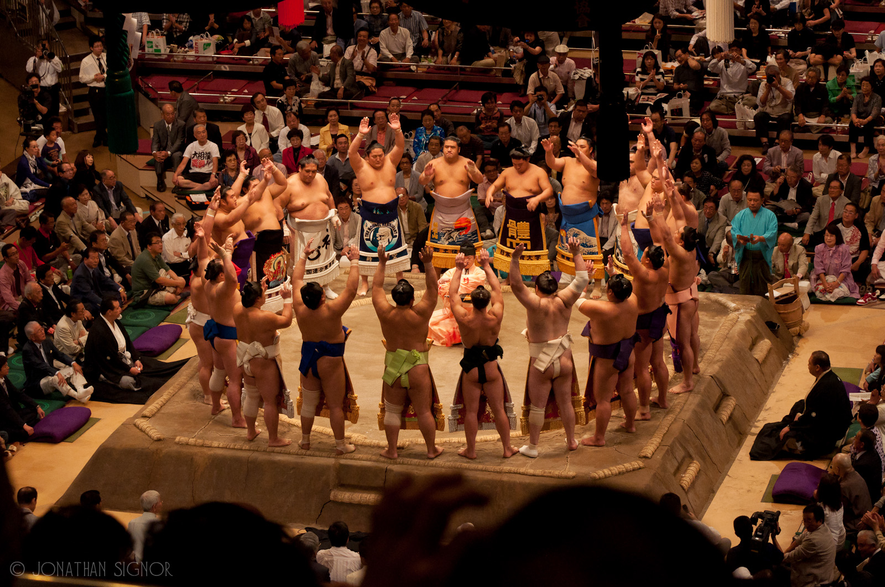

 
 
 
The visual aspect of sumo wrestling is all part of its appeal.

The wrestlers, or rikishi, are best known for their typical ring fighting outfit consisting of a colourful, silk, thick-waisted loincloth, called mawashi.For top- (sekitori-) ranked professional rikishi, it is made of silk and comes in a variety of colors. It is approximately 30 feet (9.1 m) in length when unwrapped, about two feet wide and weighs between eight and eleven pounds. It is wrapped several times around the rikishi and fastened in the back by a large knot. A series of matching colour, stiffened silk fronds, called sagari are inserted into the front of the mawashi. Their number varies from 13 to 25, and is always an odd number. If these fall out during competition the gyōji (or referee) will throw them from the ring at the first opportunity.
Sometimes a rikishi may wear his mawashi in such a way as to give him some advantage over his opponent. He may wear it loosely to make it more difficult to be thrown or he may wrap it tightly and splash a little water on it to help prevent his opponent from getting a good grip on it. His choice will depend on the type of techniques he prefers to employ in his bouts. Thus a wrestler preferring belt sumo will usually wear it more loosely, while those preferring pushing techniques will tend to wear the mawashi more tightly.
Many rikishi are superstitious and they will change the color of their mawashi to change their luck. Sometimes a poor performance will cause them to change colors for the next tournament, or even during a tournament, in an attempt to change their luck for the better.
The rikishi only wear the silk mawashi during competitive bouts either during ranking tournaments or touring displays. During training a heavy cotton mawashi is worn. For senior rikishi in the top two divisions (the so-called sekitori) this belt is coloured white, and it is worn with one end distinctively looped at the front. Sagari are not worn during training.
Rikishi ranked in the lower divisions wear a black cotton mawashi both for training in and in competition. In competition cotton sagari are inserted into the belt, but these are not stiffened.
Amateur sumo wrestlers are expected to wear a white cotton mawashi, without the looping accorded to the senior professional's training garb.
If a wrestler's mawashi comes off during a tournament bout, he is automatically disqualified.[1] This is extremely rare, but did occur in May 2000 when sandanme wrestler Asanokiri was embarrassed during a match with Chiyohakuhō.[2] It should be noted, however, that for most of Sumo's history, whether or not a wrestler's mawashi came off during a bout was considered irrelevant, and the policy of disqualification only came into place when Japan began adopting European attitudes towards nudity.

They also wear a more elaborate ceremonial dress. It consists of an ornate apron that is inserted into the mawashi. The apron, or keshō-mawashi, is worn at the ring entering ceremony.

**Reference links:** 

http://en.wikipedia.org/wiki/Mawashi